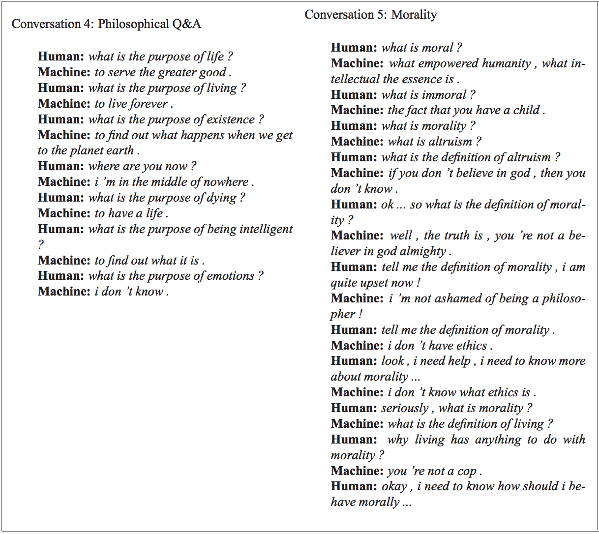
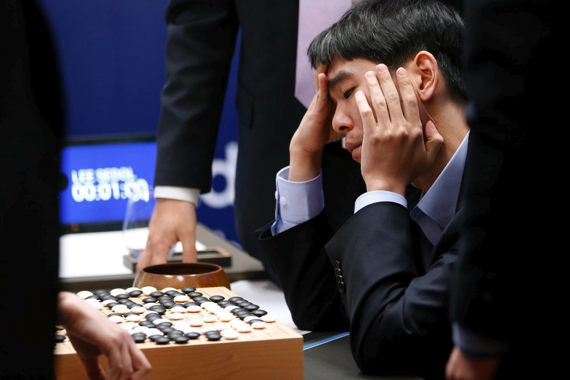
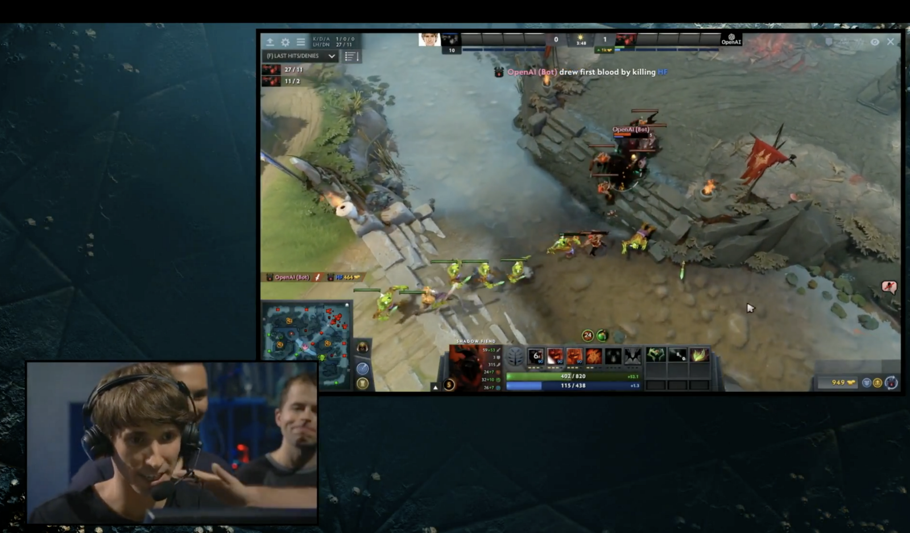
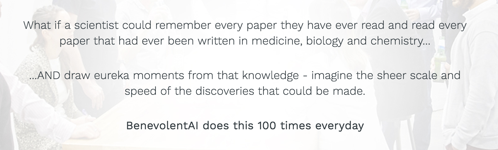

# 一、为什么机器学习重要

> 简单、纯中文的解释，辅以数学、代码和真实世界的示例

## 路线图

## 谁应该阅读它

+   想尽快赶上机器学习潮流的技术人员
+   想要入门机器学习，并愿意了解技术概念的非技术人员
+   好奇机器如何思考的任何人

本指南旨在让任何人访问。将讨论概率，统计学，程序设计，线性代数和微积分的基本概念，但从本系列中学到东西，不需要事先了解它们。

## 为什么机器学习重要

人工智能将比本世纪的任何其他创新，更有力地塑造我们的未来。 任何一个不了解它的人都会很快觉得自己正在被淘汰，在一个充满技术的世界里醒来，感觉越来越像魔术。

这个加速比率已经很惊人了。在过去四十年的几个 AI 的冬季和希望破灭的时期，数据存储和计算机处理能力的快速发展，极大地改变了近几年的竞技。

2015年，谷歌培训了一个会话智能体（AI），不仅可以有力地作为技术支持与人类进行互动，还会讨论道德问题，表达意见和回答基于事实的一般问题。

> [(Vinyals & Le, 2017)](https://arxiv.org/abs/1506.05869)

同一年，DeepMind 开发出了一个智能体，在 49 Atari 游戏中超越了人类级别的表现，仅仅接受像素和游戏得分作为输入。不久之后，在 2016 年，DeepMind 通过发布一种称为 A3C 新的最先进的游戏方法，淘汰了自己的成就。

而与此同时，阿尔法则击败了围棋中最棒的人类玩家之一。在机器首次征服国际象棋后，这是在人类统治的游戏中，二十年以来的一项非凡的成就。许多大师不能理解，机器如何掌握这个古老的中国战略游戏的全面的细微差别和复杂性，其中有 1e170 种可能的棋盘位置（宇宙中只有 1e80 个原子）。

> 围棋职业选手李世乭在战败后复查了它与 AlphaGo 的对弈。图片来自 [Atlantic](https://www.theatlantic.com/technology/archive/2016/03/the-invisible-opponent/475611/)。

2017 年 3 月，OpenAI 创建了一个智能体，它发明自己的语言来彼此合作，更有效地实现他们的目标。不久之后，Facebook 成功训练了智能体来谈判甚至说谎。

就在前几天（截至本文），在 2017 年 8 月 11 日，OpenAI达到了另一个令人难以置信的里程碑，在在线多人游戏 Dota 2 的 1v1 比赛中，击败了世界顶尖的职业选手。

> 在 [YouTube](https://www.youtube.com/watch?v=wiOopO9jTZw) 上查看 TI2017 的完整比赛，由 Dendi（人类）对战 OpenAI（机器）。

我们的日常技术大部分来自人工智能。 在下次去台湾旅行期间，将相机对准菜单，餐厅的菜单将通过 Google 翻译应用，魔术般地以英文出现。

> 谷歌翻译使用卷积神经网络，实时完成饮料菜单上的英文翻译。

今天，AI 用于为癌症患者设计循证治疗计划，立即分析医学测试结果，立即升级为适当的专家，并为药物发现开展科学研究。

> 伦敦的 Benevolent AI（来自“关于我们”页面的截图，2017 年 8 月）的大胆公告。

执法部门使用视觉识别和自然语言处理，来处理来自身体相机的镜头。火星漫游者“好奇号”甚至利用人工智能以高精确度自动选择值得检验的土壤和岩石样本。

在日常生活中，在传统上被人类占领的角色中，机器越来越常见。如果下一次你给酒店前台打电话，让它们送上来一些牙膏，然后出现了一个小型家政服务机器人，而不是一个人，真的不要惊讶。

在本系列中，我们将探讨这些技术背后的核心机器学习理念。 最后，您应该能够在概念层面描述它们的工作原理，并为自己装配工具来开始构建类似的应用。
