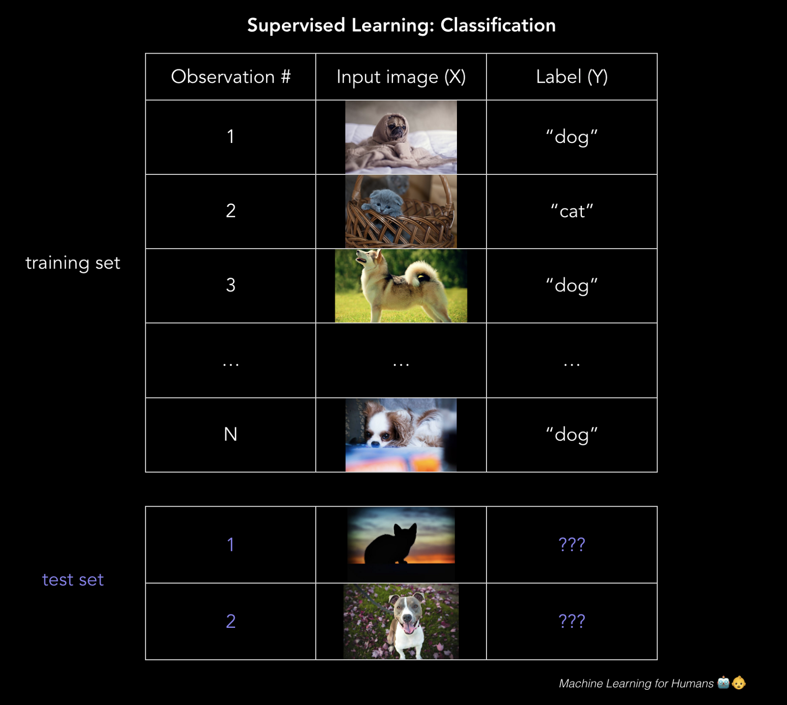
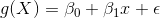
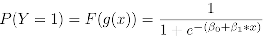
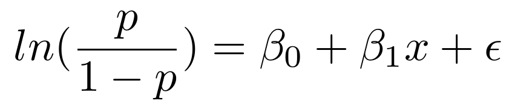
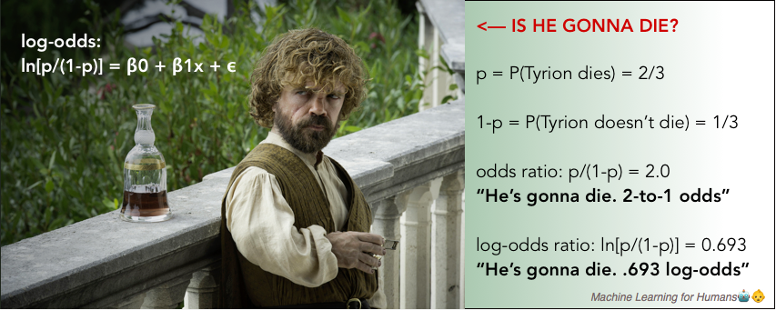
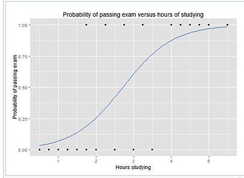

# 2.2 监督学习 II

> 使用对数几率回归（LR）和支持向量机（SVM）的分类。

## 分类：预测标签

这个邮件是不是垃圾邮件？贷款者能否偿还它们的贷款？用户是否会点击广告？你的 Fackbook 照片中那个人是谁？

分类预测离散的目标标签`Y`。分类是一种问题，将新的观测值分配给它们最有可能属于的类，基于从带标签的训练集中构建的模型。

你的分类的准确性取决于所选的算法的有效性，你应用它的方式，以及你有多少有用的训练数据。

## 对数几率回归：0 还是 1？

对数几率（logistic）回归是个分类方法：模型输出目标变量`Y`属于某个特定类的概率。

> 分类的一个很好的例子是，判断贷款申请人是不是骗子。

> 最终，出借人想要知道，它们是否应该贷给借款人，以及它们拥有一些容差，用于抵抗申请人的确是骗子的风险。这里，对数几率回归的目标就是计算申请人是骗子的概率（0%~100%）。使用这些概率，我们可以设定一些阈值，我们愿意借给高于它的借款人，对于低于它的借款人，我们拒绝他们的贷款申请，或者标记它们以便后续观察。

虽然对数几率回归通常用于二元分类，其中只存在两个类，要注意，分类可以拥有任意数量的类（例如，为手写数字分配 0~9 的标签，或者使用人脸识别来检测 Fackbook 图片中是哪个朋友）。

### 我可以使用普通最小二乘嘛？

不能。如果你在大量样本上训练线性回归模型，其中`Y = 0`或者`1`，你最后可能预测出一些小于 0 或者大于 1 的概率，这毫无意义。反之，我们使用对数几率回归模型（或者对率（logit）模型），它为分配“`Y`属于某个特定类”的概率而设计，范围是 0%~100%。

### 数学上如何工作？

注意：这一节中的数学很有意思，但是更加技术化。如果你对高阶的高年不感兴趣，请尽管跳过它。

对率模型是个线性回归的改良，通过应用 sigmoid 函数，确保输出 0 和 1 之间的概率。如果把它画出来，它就像 S 型的曲线，稍后可以看到。

> sigmoid 函数，它将值压缩到 0 和 1 之间。

回忆我们的简单线性回归模型的原始形式，我们现在叫它`g(X)`，因为我们打算在复合函数中使用它。

现在，为了解决模型输出小于 0 或者大于 1 的问题，我们打算定义一个新的函数`F(g(X))`，它将现行回归的输出压缩到`[0,1]`区间，来转换`g(X)`。你可以想到一个能这样做的函数吗？

你想到了 sigmoid 函数吗？太棒了，这就对了！

所以我们将`g(x)`插入 sigmoid 函数中，得到了原始函数的一个函数（对，事情变得高阶了），它输出 0 和 1 之间的概率。

> 换句话说，我们正在计算“训练样本属于特定类”的概率：`P(Y=1)`。

这里我们分离了`p`，它是`Y=1`的概率，在等式左边。如果我们打算求解等式右边的，非常整洁的`β0 + β1x + ϵ `，以便我们能够直接解释我们习得的`beta`参数，我们会得到对数几率比值，简称对率，它在左边。这就是“对率模型”的由来。

对数几率比值仅仅是概率比值`p/(1-p)`的自然对数，它会出现在我们每天的对话中。

> 在这一季的“权力的游戏”中，你认为小恶魔挂掉的几率有多大？

> 嗯...挂掉的可能性是不挂掉的两倍。几率是 2 比 1。的确，他太重要，不会被杀，但是我们都看到了他们对 Ned Stark 做的事情...

> 要注意在对率模型中，`β1`表示当`X`变化时，对率的变化比例。换句话说，它是对率的斜率，并不是概率的斜率。

对率可能有点不直观，但是值得理解，因为当你解释执行分类任务的神经网络的输出时，它会再次出现。

### 使用对率回归模型的输出来做决策

对率回归模型的输出，就像 S 型曲线，基于`X`的值展示了`P(Y=1)`。

