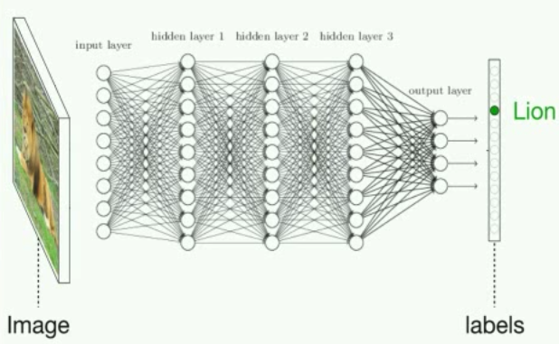

# 四、神经网络和深度学习

> 深度神经网络的工作地点、原因和方式。从大脑中获取灵感。卷积神经网络（CNN）和循环神经网络（RNN）。真实世界中的应用。

使用深度学习，我们仍然是习得一个函数`f`，将输入`X`映射为输出`Y`，并使测试数据上的损失最小，就像我们之前那样。回忆一下，在 2.1 节监督学习中，我们的初始“问题陈述”：

> `Y = f(X) + ϵ`

> 训练：机器从带标签的训练数据习得`f`

> 测试：机器从不带标签的测试数据预测`Y`

真实世界很乱，所以有时`f`很复杂。在自然语言问题中，较大的词汇数量意味着大量特征。视觉问题设计大量的像素相关的视觉信息。玩游戏需要基于复杂场景做决策，也带有许多可能的未知。当我们处理的数据不是很复杂时，我们目前涉及的学习机制做的很好。但是，它们如何推广到像这样的场景，还不清楚。

深度学习非常善于习得`f`，特别是在数据很复杂的场景中。实际上，人工神经网络也被成为通用函数近似器，因为它们能够学习任何函数，无论多么扭曲，都只需要一个隐藏层。

让我们看看图像分类的问题。我们选取一张图片作为输入，并输出一个分类（例如狗、猫、车）。

通过图解，深度神经网络的图像分类解决方式，类似于这样：

> 图片来自 Jeff Clune 在 YouTube 上的一小时深度学习概览

但是说真的，这是个巨大的数学方程，有数百万个项和大量参数。假设输入`X`是灰度图像，由`w*h`的像素亮度矩阵表示。输出`Y`是每个分类的概率的向量。也就是说，我们输出“每个分类是正确标签”的概率。如果这个神经网络能用的话，最高的概率就是正确的分类。然后，中间的层仅仅计算大量的矩阵相同，通过在每个隐藏层之后，使用非线性变换（激活函数），对激活值`x`的权重求和，来让神经网络习得非线性函数。

难以置信的是，你可以使用梯度下降，以 2.1 节中我们对线性回归所做的相同方式，使损失最小。所以使用大量样本和大量梯度下降，模型可以习得如何正确分类动物图片。这个，简单来说，就是“深度学习”。

## 深度学习做得好的地方，以及一些历史

人工神经网络实际上有很长时间了。它们的应用可追溯到控制论（cybernetics，1940s~1960s），连接机制（connectionism，1980s~1990s），之后变成了流行的深度学习。大约在 2006 年，神经网络开始变得“更深”（Goodfellow 等，2016）。但是最近我们才开始触及它们的全部潜能。

就像 Andrej Karpathy（特斯拉的 AI 总监，它被认为是深度学习的 Shaman）描述的那样，有四个“将 AI 带回来”的不同因素：

+   计算（最明显的一个：摩尔定律，GPU，ASIC）
+   数据（以不错的形式，并不在互联网上某处，也就是 ImageNet）
+   算法（研究和理念，也就是 backprop, CNN, LSTM），以及
+   基础设施（你下面的软件，Linux, TCP/IP, Git, ROS, PR2, AWS, AMT, TensorFlow, 以及其它）（Karpathy, 2016）。

在过去的十年当中，深度学习的全部潜能，最红被（1）和（2）的进步解锁，它反过来产生了（3）和（4）的突破。并且这个循环仍在继续，成倍的人们不断参与到深度学习研究的前线中，沿着这条路（想想你现在做的事情）。

> 由 NVIDIA 演示，它是一家~~核弹~~ GPU 领导厂商。GPU 最开始为游戏构建，但是最终很好地顺应了深度学习所需的并行计算。

在这一章的剩余部分中，我们提供一些来自生物和统计的被寂静，来解释神经网络里面发生额了什么，之后讨论深度学习的一些神奇应用。最后，我们链接到一些资源，所以你可以自行应用深度学习，甚至穿着睡衣坐在沙发上，拿着笔记本，在特定种类的问题上快速实现超越人类级别的表现。

