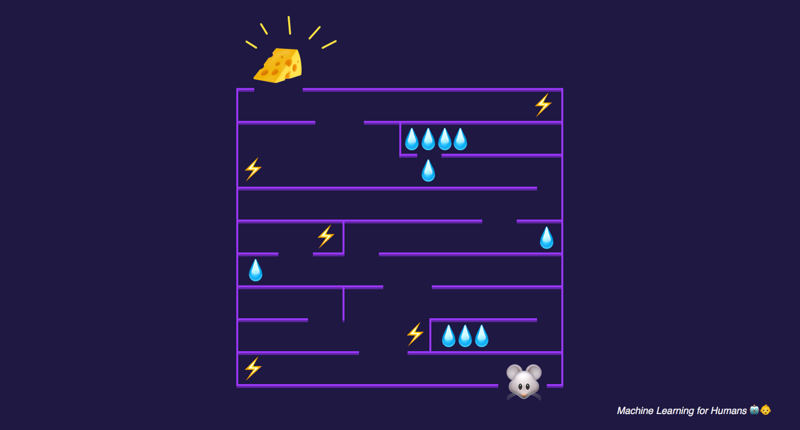
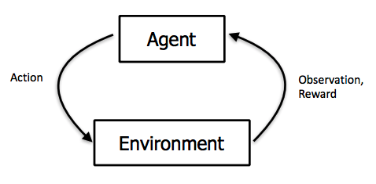
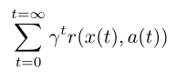
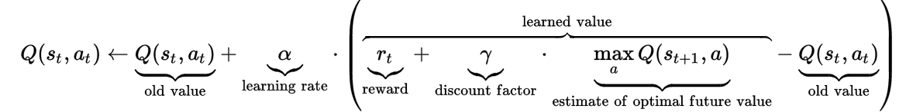

# 五、强化学习

> 探索和利用。马尔科夫决策过程。Q 学习，策略学习和深度强化学习。

> 我刚刚吃了一些巧克力来完成最后这部分。

在监督学习中，训练数据带有来自神一般的“监督者”的答案。如果生活可以这样，该多好！

在强化学习（RL）中，没有这种答案，但是你的强化学习智能体仍然可以决定如何执行它的任务。在缺少现有训练数据的情况下，智能体从经验中学习。在它尝试任务的时候，它通过尝试和错误收集训练样本（这个动作非常好，或者非常差），目标是使长期奖励最大。

在这个“写给人类的机器学习”的最后一章中，我们会探索：

+   探索和利用的权衡
+   马尔科夫决策过程（MDP），用于 RL 任务的经典配置
+   Q 学习，策略学习和深度强化学习
+   最后，分值学习的问题

最后，像往常一样，我们编译了一些最喜欢的资源，用于深入探索。

## 让我们在迷宫中放一个机器老鼠

思考强化学习的最简单的语境是一个游戏，它拥有明确的目标和积分系统。

假设我们正在玩一个游戏，其中我们的老鼠正在寻找迷宫的尽头处的奶酪的终极奖励（🧀 + 1000 分），或者沿路的水的较少奖励（💧 + 10 分）。同时，机器老鼠打算避开带有电击的区域（⚡ - 100 分）。

> 奖励就是奶酪

在一些探索之后，老鼠可能找到三个水资源的小型天堂，并且花费它的时间来利用它的发现，通过不断积累水资源的小型奖励，永远不深入迷宫来追求更大的奖励。

但是你可以看到，老鼠会错误迷宫深处的一片更好的绿洲，它就是尽头处的奶酪的终极奖励。

这就产生了探索和利用的权衡。老鼠的一种用于探索的简单策略是，在大多数情况下（可以是 80%），做出最佳的已知动作，但是偶尔探索新的，随机选取的方向，即使它可能远离已知奖励。

这个策略叫做 epsilon 贪婪策略，其中 epsilon 就是“给定全部已知知识的条件下，智能体做出随机选取的动作，而不是更可能最大化奖励的动作”的时间百分比（这里是 20%）。我们通常以大量探索起步（也就是较高的 epsilon 值）。一会儿之后，随着老鼠更加了解迷宫，以及哪个操作产生更大的长期奖励，它会将 epsilon 逐渐降到 10%，或者甚至更低，因为它习惯于利用已知。

重要的是要记住，奖励并不总是立即的：在机器老鼠的示例中，迷宫里可能有狭长的通道，你需要走过它，在你到达奶酪之前可能有好几个决策点。

> 智能体观测环境，做出动作来与环境互动，并接受正向或者负向的奖励。图片来自 [UCB CS 294：深度强化学习](https://rll.berkeley.edu/deeprlcourse-fa15/)，由 John Schulman 和 Pieter Abbeel 讲授

## 马尔科夫决策过程

老鼠迷宫之旅可以形式化为马尔科夫决策过程。这是一个过程，状态到状态的转移拥有特定的概率。我们会通过参考我们的机器老鼠的示例来解释。MDP 包含：

+   有限的状态集。我们的老鼠在迷宫中有可能的位置。
+   每个状态上的可用的动作集。这个就是走廊中的“前进，后退”，或者十字路口中的“前进，后退，左转，右转”。
+   状态之间的转换。例如，如果在十字路口左转，你就会到达一个新的位置。一系列概率可能链接到至少一个状态上（也就是，当你在口袋妖怪游戏中使用招式的时候，可能没打中，造成一些伤害，或者造成足够的伤害来击倒对手）。
+   和每个转换有关的奖励。在机器老鼠的例子中，多数奖励都是 0，但是如果你到达了一个位置，那里有水或者奶酪，就是正的，如果有电击就是负的。
+   0 和 1 之间的折现系数`γ`。它量化了立即奖励和未来奖励的重要性的差异。例如，如果`γ`是 0.9，并且 3 步之后奖励为 5，那么奖励的当前值就是`0.9 ** 3 * 5`。
+   无记忆。一旦知道了当前状态，老鼠的历史迷宫踪迹可以擦除，因为马尔科夫的当前状态包含来自历史的所有拥有信息。换句话说，“了解现在的情况下，未来不取决于历史”。

既然我们知道了 MDP 是什么，我们可以形式化老鼠的目标。我们尝试使长期奖励之和最大。

让我们逐项观察这个和式。首先，我们所有时间中对步骤`t`求和。让我们在这里将`γ`设为 1 并忘掉它。`r(x,a)`是奖励函数。对于状态`x`和动作`a`（也就是在十字路口左转），它会带给你奖励，和状态`s`上的动作`a`相关。回到我们的方程，我们尝试使未来奖励的和最大，通过在每个状态做出最佳动作。

既然我们建立了我们的强化学习问题，并形式化了目标，让我们探索几种可能的解决方案。

## Q 学习：学习动作-分值函数

Q 学习是一种技巧，它基于动作-分值函数求解了要做出哪个动作，这个函数确定了在特定状态下做出特定行为的分值。

我们拥有一个函数`Q`，它接受一个状态和一个动作作为输入，并返回这个动作（以及所有后续动作）在这个状态上的预期奖励。在我们探索环境之前，`Q`提供相同（任意）的固定值。但是之后，随着我们探索了更多环境，`Q`向我们提供动作`a`在状态`s`上的分值的，不断优化的近似。我们在这个过程中更新我们的函数`Q`。

这个方程来自维基百科的 Q 学习页面，很好解释了它。他展示了，我们如何更新 Q 的值，基于我们从环境中得到的奖励：

让我们忽略折现系数`γ`，再次将其设为 1。首先要记住，Q 应该为所有奖励之和，来自所选动作 Q 和所有后续的最优动作。

现在让我们从左到右浏览方程。让我们在状态`st`上做出动作，我们更新我们的`Q(st,at)`的值，通过向其添加一项。这一项包含：

+   学习率`alpha`：这表示在更新我们的值时，我们有多激进。当`alpha`接近 0 时，我们更新得不是很激进。当`alpha`接近 1 时，我们简单将原值替换为新的值。
+   奖励`reward`就是我们通过在状态`st`做出动作`at`得到的奖励。所以我们将这个奖励添加到原有的估计中。
+   我们也添加了估计的未来奖励，它就是`xt+1`上的所有可用动作的，最大的可实现的奖励`Q`。
+   最后，我们减掉原有值`Q`，来确保我们仅仅增加或减少估计值的差（当然要乘上`alpha`）。

既然对于每个状态-动作的偶对，我们拥有了值的估计，我们可以选取要做出哪个动作，根据我们的动作-选取策略（我们每次不一定选择导致最大预期奖励的动作，也就是使用 epsilon 贪婪探索策略，我们以一定百分比做出随机的动作）。

在机器老鼠的例子中，我们可以使用 Q 学习来找到迷宫中每个位置的分值，以及每个位置上动作“前进，后退，左转，右转”的分值。之后我们可以使用我们的动作-选取策略，来选择老鼠在每一步实际上做什么。
